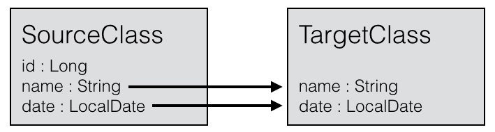

# Beanmapper

Beanmapper is a Java library for mapping dissimilar Java classes with similar names. The use
cases for Beanmapper are the following:
* mapping from forms to entities, because:
  * for security reasons you want to accept only a limited number of fields as input
  * the form fields are simplified to support frontend processing
* mapping from entities to results, because:
  * you want to simplify the result for frontend processing
  * you want to expose a limited number of fields for security reasons

## Maven dependency

In order to use Beanmapper in your project, simply add the following Maven dependency:

```xml
<dependency>
    <groupId>io.beanmapper</groupId>
    <artifactId>beanmapper</artifactId>
    <version>0.2.5</version>
</dependency>
```

## Getting started

You want to map two dissimilar classes with no hierarchical relation (save java.lang.Object), 
but with a fairly similar naming schema for the fields.



```java
public class SourceClass {
   public Long id;
   public String name;
   public LocalDate date;
}
```

```java
public class TargetClass {
   public String name;
   public LocalDate date;
}
```

```java
BeanMapper beanMapper = new BeanMapper();
SourceClass source = new SourceClass();
source.id = 42L;
source.name = "Henk";
source.date = LocalDate.of(2015, 4, 1));
TargetClass target = beanMapper.map(source, TargetClass.class);
```

## What's more?

The library can help you with the following situations:
* nested dissimilar classes
* ignoring parts
* mapping to fields with other names, even if nested
* settings defaults if no value is found
* unwrapping class layers in order to flatten the structure
* works directly on the bean, no getters/setters required
* supports a combination of automated and manual processing
* adding conversion modules for data types

## What Beanmapper is not for

Beanmapper is *not* a library for deep-copying classes. Whenever Beanmapper can get away with a shallow
copy, it will do so. Deep-copying is reserved for dissimilar classes.

## Want to know more?

Find the rest of the documentation on [beanmapper.io](http://beanmapper.io).